  

<h1 align="center">William Youkna</h1>

  Computer & Electrical Engineering Student • Robotics • Computer Vision • Embedded Systems

---

## 👋 About Me
I’m a Computer & Electrical Engineering student focused on **robotics, embedded systems, and computer vision**.

My work revolves around building systems that interact with the physical world — from low-level hardware control to higher-level perception and autonomy.

I’m particularly interested in:
- Autonomous systems (drones, vehicles)
- Embedded programming (microcontrollers, real-time systems)
- Computer vision for robotics (OpenCV, perception pipelines)

---

## 🛠️ Tech Stack

### Languages

  
  

### Tools & Platforms

  
  
  
  
  

---

## 🚀 Current Focus
- Building autonomous drone systems (PX4 + sensors + CV)
- Learning computer vision pipelines before hardware deployment
- Developing reusable embedded + robotics components

---

## 🤝 Collaboration
I’m open to collaborating on:
- Robotics projects (ROS, drones, automation)
- Computer vision applications
- Embedded systems development

---

## 📫 Contact

  

---

## 📊 GitHub Stats

  
  

